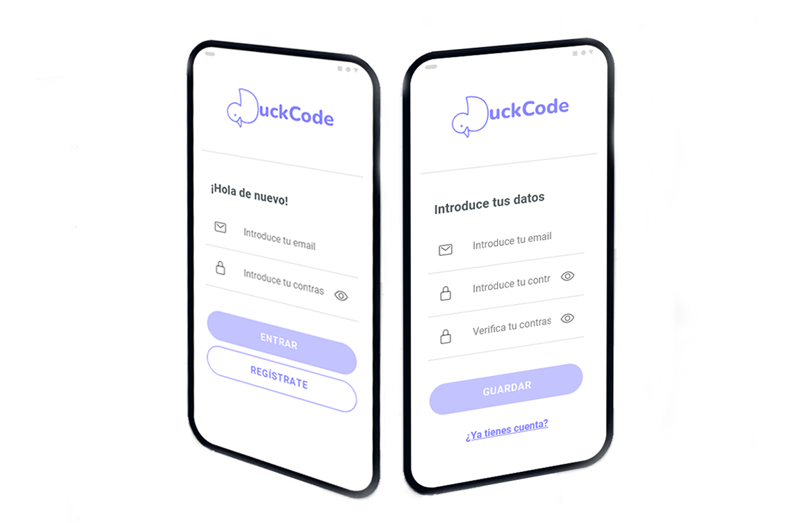
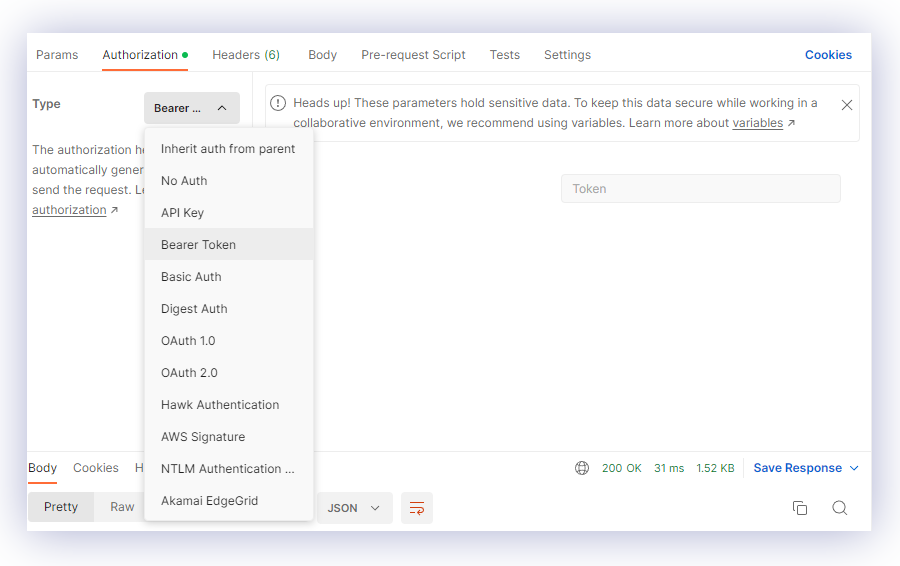
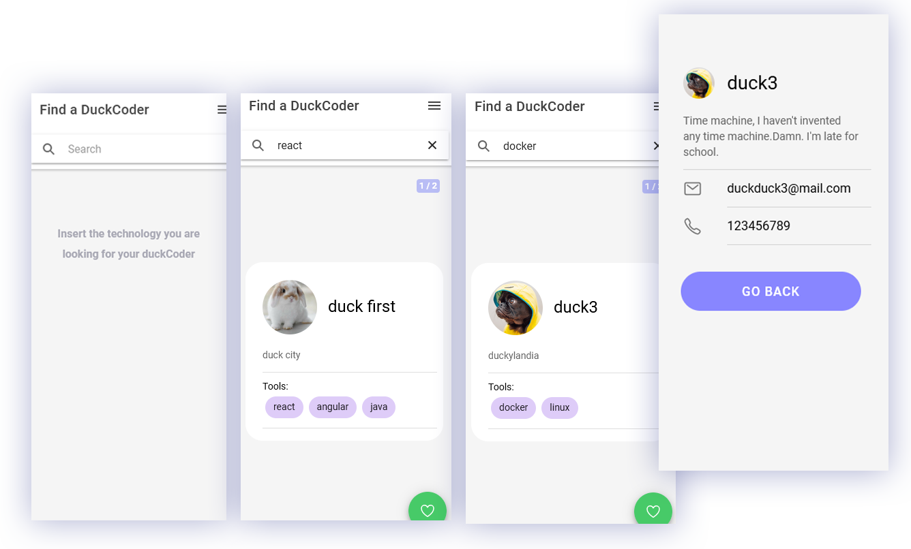
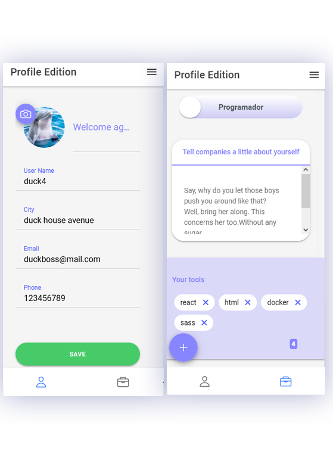

# 👩‍💻 DuckCode App 🦆

DuckCode is a networking mobile app, to easily find professionals in the tech sector.
The name is an allusion to the "rubber duck debugging method", which consists of describing to a rubber duck the code you have been programming, in order to find a solution that didn't want to appear. Programmers often get stuck on a problem, and when they tell another programmer, or anyone else, they suddenly see the solution clearly.  

I wanted to allude to this method to refer to this app as a place where you can find collaborative problem solvers, programmers.


➜ [RubberDucking](https://en.wikipedia.org/wiki/Rubber_duck_debugging)





---

## 💾 Download the project

Create a folder for the project and run

git clone https://github.com/abigailojeda/duckcodeapp.git .

With the "." at the end you specify that you want the project to be cloned into that folder, and not create a new folder to clone itself.

## 📂  What do you need to have installed on your computer?

➜ Node [LTS Version](https://nodejs.org/en/)
➜ Ionic: npm install -g @ionic/cli

---
### 📚  What do you need to have installed on your computer?
This project also use:  
➜ [Express](https://expressjs.com/es/4x/api.html)  
➜ [Multer](https://www.npmjs.com/package/multer)  
➜[jsonwebtoken](https://www.npmjs.com/package/jsonwebtoken)

---

#### 👨‍🚀 check POSTMAN endpoints 

[Run in Postman](https://documenter.getpostman.com/view/18449118/2s8YmNS3Xf)  
  
IMPORTANT:  
This app use authentification, so you need a token to try this endpoints.  
To get the token, you only need to:  
- Run app  
- Create an user  
- Login   
- Check localhost, and there you will find the token  




## ⚙️ Project Settings

### backend
In the backend folder( cd backend),  install the dependencies:
➜ npm install

IMPORTANT:

You need to create a .env file for configuration:
```javascript
JWT_SECRET=aSecretYouDecideToWrite

MYSQL_DATABASE=db_duck_network
MYSQL_USER=yourUsername
MYSQL_PASSWORD=yourPassword 
MYSQL_ROOT_PASSWORD= yourPassword  

DB_HOST= yourHost

NODE_ENV=development
```

You also need to create a the "db_duck_network" local database


### frontend
In the frontend folder( cd frontend),  install the dependencies:
➜ npm install


## 🔎 what will you find in DuckCode app?  

### ➜ Duckcoders search engine  

### ➜ Profile editing  



---
👨🏻‍🎓 Thanks to Tiburcio Cruz Ravelo, a great teacher.

---
 🙋🏻‍♀️ [Abigail Ojeda Alonso](https://es.linkedin.com/in/abigail-ojeda)
